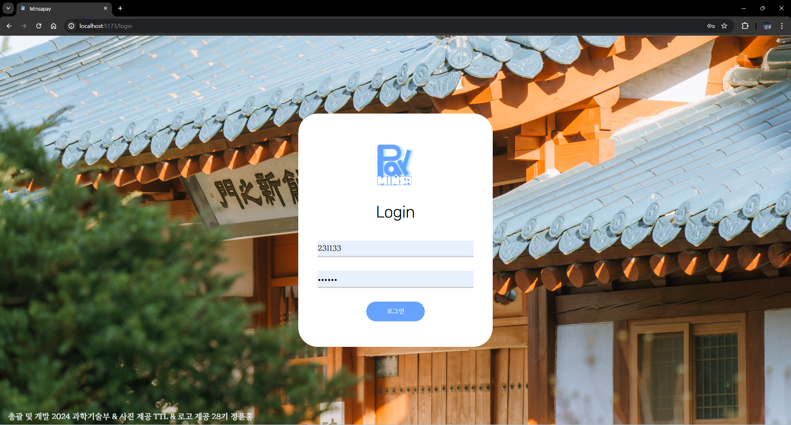

# 민사페이 내부용 설명서
<span style="color:gray;">민사페이란 교내 파티 및 민족제에서 사용하는 결제 시스템이다. 2024년에 새로 개발된 민사페이는 기존에 단순 결제 자체만 가능했던 기존의 민사페이를 개선하여 상품 단위의 처리를 가능하게 하는 것을 골자로 하였다. 이 서비스는 부스 내 키오스크와 부스 사용자, 개별 사용자의 상호작용으로 이루어진다.</span>

<span style="color:gray;">본 문서는 과학기술부 내부에서 이 서비스에 대한 공통적인 이해를 확립하기 위한 목적으로 작성되었다.</span>

#### 목차
1. 민사페이 사용자 종류 및 구조
2. 민사페이 상호작용
3. 페이지 ui/ux 설명
<br /> 

## 1. 민사페이 사용자 종류 및 구조
- **seller**: 동아리/부서 등 민족제에서의 판매자. seller mobile과 cpu를 통침한다.
  - **seller mobile(부스 개별 사용자)**: 부스/동아리에서 접근하능한 개인 판매자 계정.
  - **cpu**: 동아리/부스 판매의 총 관리자 계정.
- **kiosk**: 구매자들이 물품/서비스를 소비할 수 있게 하는 계정.
- **buyer**: seller들이 제공하는 물품/서비스를 소비할 수 있는 계정. 
<br />

## 2. 민사페이 상호작용


### 1. 로그인
``` 
로그인  -> 1. admin             ... => logout -> 로그인
        -> 2. cpu
        -> 3. seller mobile
        -> 4. buyer
        -> 5. kiosk
```

### 2 adimin
```
adimin
```

### 3 cpu
```
cpu -menu 편집  -> menu 편집
    -주문내역   
    -환불 승인  -> 환불 목록
```
<!--
### 4 seller mobile <span style="color:red"> 수정필요 </span>
```
seller mobile -> 주문내역
```
-->
### 5 buyer
```
buyer -주문내역   -물품/서비스
                  -부서/동아리
                  -금액
                  -환불요청
      -잔고
      -결제  -> (kiosk) authentication -> buyer home
```
### 6 kiosk
```
kiosk -부서/동아리 지정화면(=home) -> authentication(번호생성) -> menu 및 결제 -> thankyou -> home
```
<br />

## 3. 페이지 ui/ux 설명
### 1. 로그인


### 2 adimin
**admin id & password**<br/>
Admin@developer<br/>
happykwagi2024<br/>


### 3 cpu
**admin id & password**<br/>
kwagibu@CPU<br/>
kwagibu<br/>


<!--
### 4 seller mobile <span style="color:red"> 수정필요 </span>

**admin id & password**<br/>
Admin@developer<br/>
happykwagi2024<br/>


-->

### 5 buyer
**admin id & password**<br/>
231133<br/>
231133<br/>


### 6 kiosk
**admin id & password**<br/>
kwagibu@kiosk<br/>
kwagibu<br/>

<br/>
<br/>
<br/>
<br/>