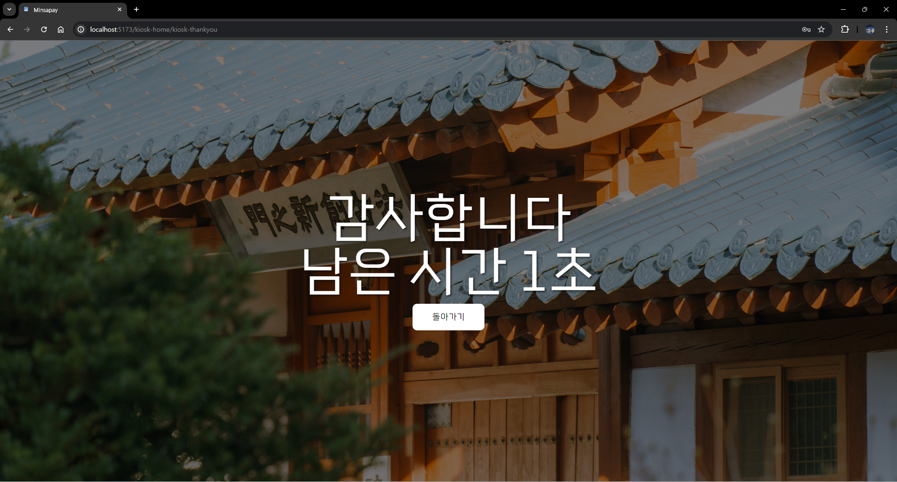

# 과학기술부 내부 배포용 민사페이 설명서
<span style="color:gray;">민사페이란 교내 파티 및 민족제에서 사용하는 결제 시스템이다. 2024년에 새로 개발된 민사페이는 기존에 단순 결제 자체만 가능했던 기존의 민사페이를 개선하여 상품 단위의 처리를 가능하게 하는 것을 골자로 하였다. 이 서비스는 부스 내 키오스크와 부스 사용자, 개별 사용자의 상호작용으로 이루어진다.</span>

<span style="color:gray;">본 문서는 과학기술부 내부에서 이 서비스에 대한 공통적인 이해를 확립하기 위한 목적으로 작성되었다.</span>

#### 목차
1. 민사페이 사용자 종류 및 구조
2. 민사페이 상호작용
3. 페이지 ui/ux 설명
<br /> 

## 1. 민사페이 사용자 종류 및 로그인 정보
#### 사용자 종류
- **seller**: 동아리/부서 등 민족제에서의 판매자. seller mobile과 cpu를 통칭한다.
  - **seller mobile(부스 개별 사용자)**: 부스/동아리에서 접근하능한 개인 판매자 계정.
  - **cpu**: 동아리/부스 판매의 총 관리자 계정.

- **kiosk**: 구매자들이 물품/서비스를 소비할 수 있게 하는 계정.
- **buyer**: seller들이 제공하는 물품/서비스를 소비할 수 있는 계정. 
<br />

#### 로그인 정보
- 개인 사용자: 자신의 학번으로 로그인
  - buyer
  - seller
- 부스 사용자: (부스이름)@cpu or (부스이름)@kiosk 으로 로그인
  - 부스 통합 계정(cpu)
  - kiosk

## 2. 민사페이 상호작용
<span style="color:gray;">3번 ui/ux 설명과 같이 보면 이해가 보다 쉽다</span><br/>


### 1. 로그인
``` 
로그인  -> 1. admin             ... => logout -> 로그인
        -> 2. cpu
        -> 3. seller mobile
        -> 4. buyer
        -> 5. kiosk
```

### 2. adimin
```
adimin
```

### 3. cpu
```
cpu -menu 편집  -> menu 편집 [kiosk menu에 즉시 반영됨]
    -주문내역   
    -환불 승인  -> 환불 목록 [buyer 구매 목록에 즉시 반영됨]
```

### 4. seller mobile 
```
seller mobile -> 부스1  ...=> -주문자
                              -제품명
                              -처리 단계 [처리단계에 따라 텍스트가 바뀜]
                              -담당자 [처리단계 변경 버튼을 누른 사람의 이름으로 바뀜]
                              -처리단계 변경 버튼 [처리단계이 바뀜에 따라 buyer 구매 목록에 즉시 반영됨]
              -> 부스2
```

### 5. buyer
```
buyer -주문내역   -물품/서비스 이름
                  -부서/동아리
                  -금액
                  -환불요청
                  [환불요청을 하게되면 cpu의 환불 승인 페이지의 목록으로 들어가게 됨]
      -잔고
      -결제  -> (kiosk) authentication -> buyer home
```
### 6. kiosk
```
kiosk -부서/동아리 지정화면(=home) -> authentication(번호생성) -> menu 및 결제 -> thankyou -> home
```
<br />

## 3. 페이지 ui/ux 설명
### 1. 로그인

#### 로그인 방법
민사페이의 사용자 종류는 크게 두 가지이다. 첫번째는 개인 사용자로 이들은 모두 자신의 학번으로 로그인을 하게 된다. 두번째 종류는 부스 사용자로 부스 통합 계정과 키오스크 계정이 있다. 이 계정들은 각각 ‘(부스이름)@CPU’와 ‘(부스이름)@kiosk’를 ID로 사용한다. 

### 2. admin
<!-- Admin@developer -->
<!-- happykwagi2024 -->


관리자 계정이다. 
#### 기능
1. get database info
2. upload database
3. submit database(비밀번호 입력 필요)

### 3. cpu
> **kwagi cpu id & password**<br/>
kwagibu@CPU<br/>
kwagibu<br/>


<!-- 캡처수정: 이미지에 숫자 넣기 -->
#### 구성요소
1. 민사페이 로고
2. 로그아웃
3. 부서/동아리 배너
4. 부서/동아리 잔고
5. 부서/동아리 배너 바꾸는 버튼(카메라모양)
6. 메뉴 편집
7. 환불 승인
8. 주문내역

| 제품/서비스 명 | 주문자명 | 주문 당시 시간(시:분:초) | 처리단계 | 색 |
|----------|----------|----------|----------|----------|
|자고일어났다|조유찬|20:33:28| 승인하기|(색)|

- 색
  - <span style="color:#99CCFF;"> 연한파란색 <span>: 처리 중
  - <span style="color:#2079FF;"> 진한파란색 <span>: 요청
  - <span style="color:#FE554A;"> 빨간색 <span>: 환불 요청
  - <span style="color:#D9D9D9;"> 회색 <span>: 환불 완료
  
<br/>


#### 구성요소
1. 로고(로고를 클릭하면 홈화면으로 돌아감)
2. 로그아웃
3. 메뉴명 : 7글자로 이하로 제한함
4. 금액
5. 이미지 선택
6. 메뉴 목록
=> 편집 섹션: edit, delete
<!-- 캡처수정: 이미지에 숫자 넣기 -->
<br/>


| 제품/서비스 명 | 주문자명 | 주문 당시 시간(시:분:초) | 승인하기(버튼) | 색(환불요청) |
|----------|----------|----------|----------|----------|
|자고일어났다|조유찬|20:33:28| 승인하기|(색)|


### 4. seller mobile <span style="color:red"> 수정필요 </span>
> **kwagi seller id & password**<br/>
231133@seller<br/>
231133<br/>


#### 주문목록
| 주문자명 | 물품/서비스명 & 주문 당시 시간(시:분:초)| | 처리 단계 | 담당자 |처리 단계 변경 버튼 |
|----------|----------|----------|----------|----------|----------|


### 5. buyer
> **kwagi buyer id & password**<br/>
231133<br/>
231133<br/>


#### 구성요소
1. 로고
2. 잔고
3. 설정
4. 주문내역
5. 결제(카드아이콘)
<!-- 캡처수정: 이미지에 숫자 넣기 -->
<br/>


#### 구성요소
1. 키패드
2. C
3. OK
4. 홈
<br/>


#### 설정페이지
1. 홈화면
2. 로그아웃
3. 현재 비밀번호 입력창
4. 새로운 비밀번호 입력창
5. 변경 완료 버튼
<br/>
<!-- 캡처수정: 이미지에 숫자 넣기 -->

### 6. kiosk
> **kwagi kiosk id & password**<br/>
kwagibu@kiosk<br/>
kwagibu<br/>

<br/>

배경화면 <= 부서/동아리 배너

<br/>

홈 화면에서 화면터치를 하면 kiosk authentication화면으로 넘어오게 된다. 이때 5자리 숫자는 무작위의 수로 buyer의 계정을 인식하는 역할을 한다. 이후 buyer의 결제 화면에서 숫자를 입력하고 그 숫자가 kiosk authentication 화면에 뜬 숫자와 같을 때 buyer를 인식하고 결제화면으로 이동한다


<br/>

#### 구성요소
1. 주문 취소
2. 메뉴
3. 내 카트
4. total
5. pay

#### 메뉴
1. 이미지
2. 물품/서비스 제목
3. 가격
4. 카트에 추가


<br/>
10초 다시 키오스크 홈화면으로 