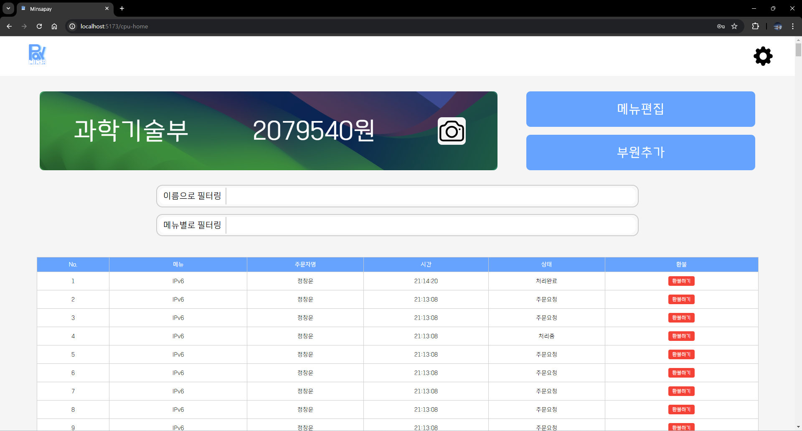
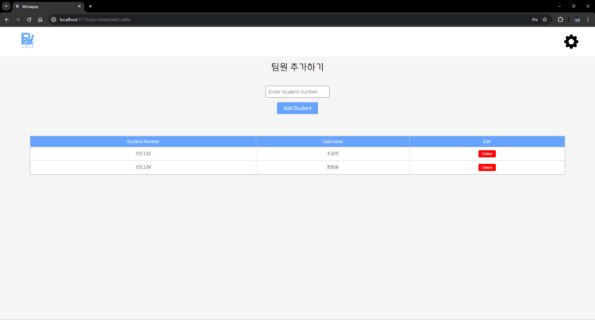
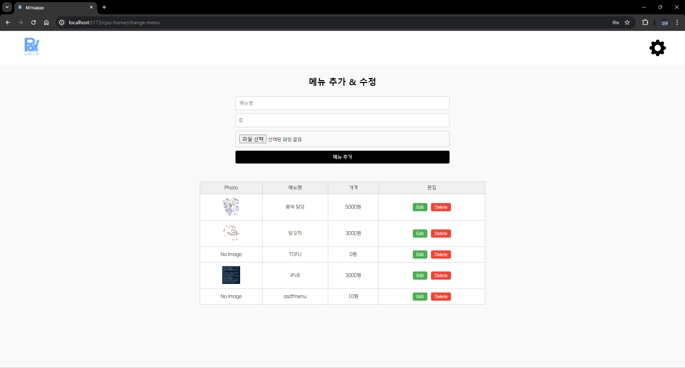
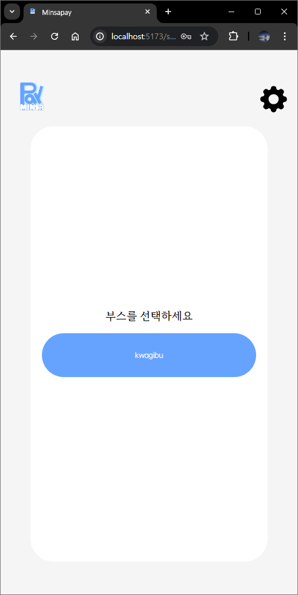
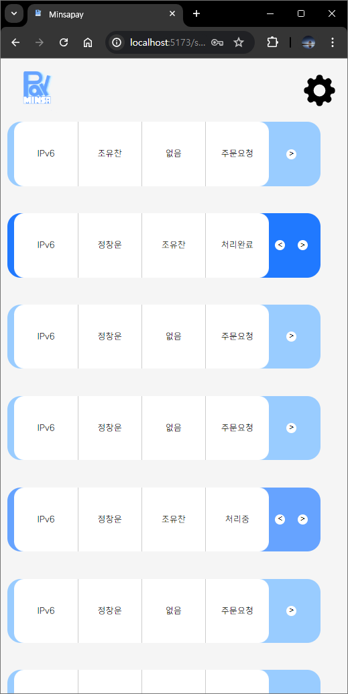
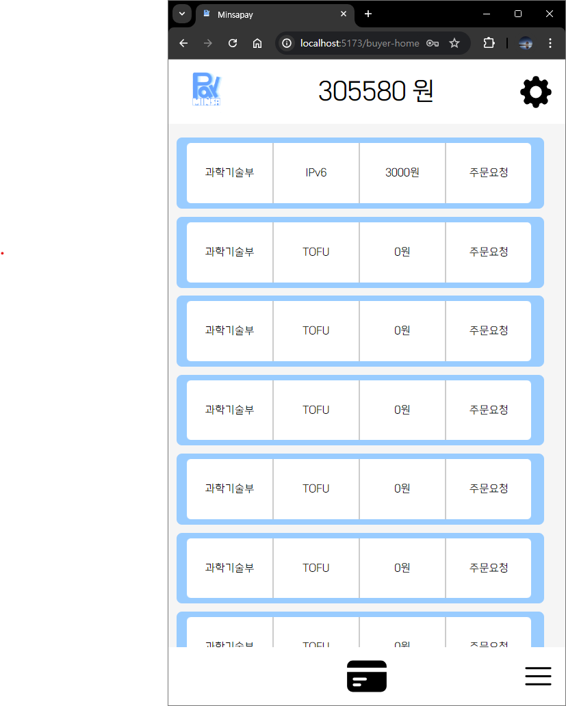
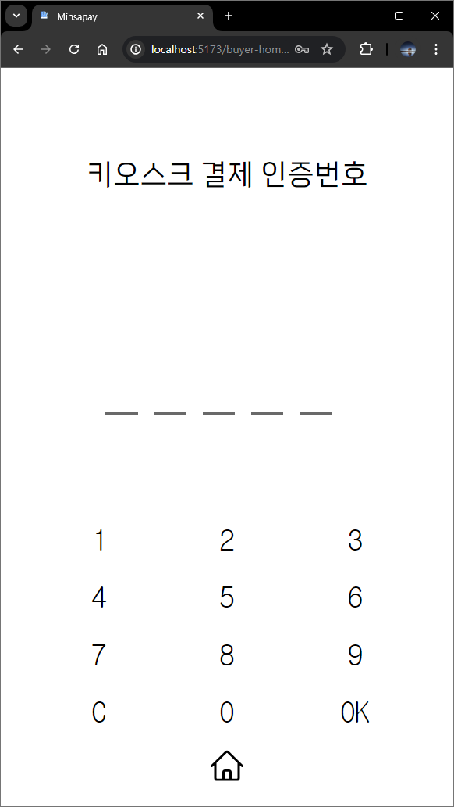
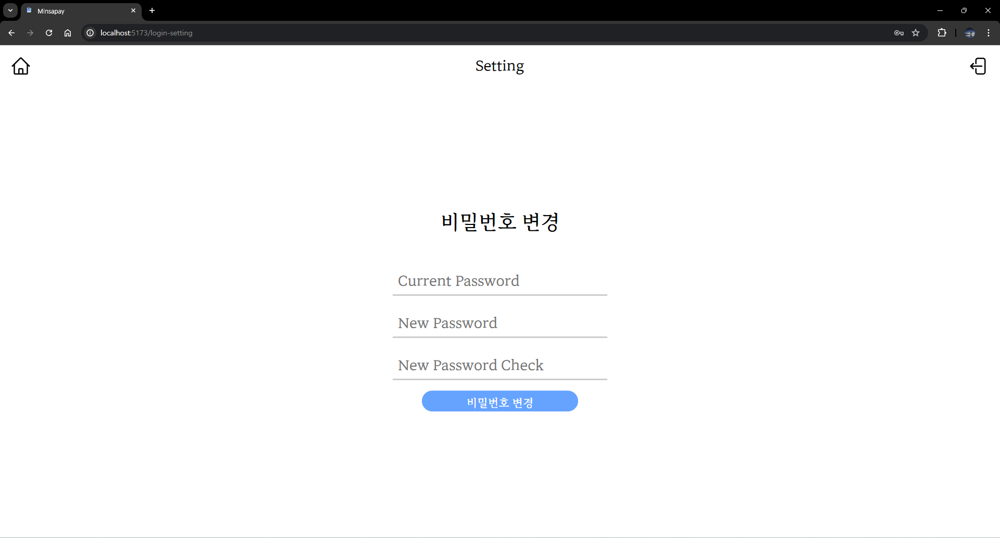

# 과학기술부 총합 민사페이 설명서
## 0. Introduction
### Introduction
<span style="color:gray;">민사페이란 교내 파티 및 민족제에서 사용하는 결제 시스템이다. 	2024년에 새로 개발된 민사페이는 기존에 단순 결제 자체만 가능했던 기존의 민사페이를 개선	하여 상품 단위의 처리를 가능하게 하는 것을 골자로 하였다. 이 서비스는 부스 내 키오스크와 	부스 사용자, 개별 사용자의 상호작용으로 이루어진다.</span>

<span style="color:gray;">본 문서는 과학기술부 내부에서 이 서비스에 대한 공통적인 이해를 	확립하기 위한 목적으로 작성되었다.</span>

### 목차
  1. 민사페이 사용자종류
  2. 민사페이 외/내부 상호작용
  3. 사용자 메뉴얼

## 1. 민사페이 사용자종류
### 사용자 종류
- **부스**: 동아리/부서 등 교내 파티 및 민족제에서의 판매자가 물건/서비스를 제공하는 장소를 말한다
    - **부스통합계정(cpu)**: 부스에서의 판매를 한번에 관리 가능한 계정, 총관리자 계정을 말한다
    - **키오스크 kiosk**: 구매자와 부스에서 물품/서비스를 소비할 수 있게 하는 계정이다
    - **부스 개별 사용자(seller)**: 부스 내에서의 주문 처리 단계에 접근 가능한 개인계정이다.
- **개별 구매자(buyer)**: 소비자, 구매자

## 2. 민사페이 외/내부 상호작용
<br/>
### 1. **로그인**
``` 
로그인  -> 1. cpu           
        -> 2. seller mobile
        -> 3. buyer
        -> 4. kiosk
```
<!-- 추가정보 필요 -->
1. firebase에서 아이디와 비밀번호가 맞는지 확인하고 각각의 아이디에 따라 4개의 화면으로 넘어간다
2. 로그인 정보는 3번 사용자 메뉴얼에서 확인

### 2. **cpu**
```
cpu -menu 편집    -> menu 편집 [kiosk의 메뉴판에 즉시 적용된다]
    -부원 추가    -> add-seller [seller???]
    -로그(번호, 메뉴, 주문자명, 시간, 상태, 환불)
        -Refund   -> 
```
<!-- cpu 설명 듣기(부원추가, 환불) , 추가정보 필요-->
1. 메뉴편집-firebase
2. 부원추가-어떤메커니즘으로 추가되는지 seller에 어떻게, 어디에 작용하는지
3. 로그-특히 환불 백엔드 설명

### 3. **kiosk**
```
부서/동아리 지정화면(cover) -> authentication -> menu 추가 및 결제(home)-> thankyou -> cover {순환}
```
<!-- 추가 정보 필요 -->
(설명 1. 지정화면 설정 - firebase
      2. authentication
      3. menu 결제
      4. thankyoupage )

### 4. **seller**
```
seller mobile -> 부스1(선택)->  -주문자
                                -제품명
                                -처리 단계 
                                -담당자
                                -처리단계 변경 버튼[cpu]
              -> 부스2
```
<!-- 추가 정보 필요 -->
(설명 1. 주문자가 들어오는 과정
      2. 제품명이 들어오는 과정
      3. 처리단계에서 색이 바뀌는 과정
      4. 담당자 바뀌는 과정
      5. 처리단계 변경버튼 -> cpu로 가는 과정)

### 5. **buyer**
```
buyer -주문내역   -물품/서비스 이름
                  -부서/동아리
                  -금액
      -잔고
      -결제  -> keypad -> [kiosk authentication] -> buyer home
```
<!-- 추가 정보 필요 -->
(설명 1. 주문내역에서 물품서비스 이름이 연동되는 과정
      2. kiosk authentication)

## 3. 사용자 메뉴얼
### 1. 로그인

#### 아이디
- 부스
    - 부스통합계정(cpu): **(부서이름)@cpu**
    - 키오스크 kiosk: **(부서이름)@kiosk**
    - 부스 개별 사용자(seller): **(학번)@seller**
- 개별 구매자(buyer): **학번**

#### 비밀번호
기본비밀 번호를 주고 개인적으로 비밀번호를 바꿀 예정

### 2. 부스
1. #### cpu <br/>
    
    1. 해더 <span style="color:gray;">자세한 설명은 4번 공통화면에서 확인</span><br/>
    2. 부스 커버
        - 부스 커버 바꾸는 버튼(=사진기버튼): kiosk와 cpu 부스 커버에서 보이는 사진을 변경 가능하다
    3. 메뉴편집: 메뉴편집 페이지로 넘어간다
    4. 부원추가: 부원추가 페이지로 넘어간다
    5. 주문자 이름으로 필터링: 주문자 이름으로 검색
    6. 메뉴별로 필터링: 메뉴이름으로 검색 
    7. 주문 목록
        1. no.
        2. 메뉴(상품명)
        3. 주문자명
        4. 시간: 주문한 시간
        5. 상태: <span style="color:#99CCFF;">주문요청</span>, <span style="color:#66A3FF;">처리중</span>, <span style="color:#2079FF;">처리완료</span>, <span style="color:#D9D9D9">수령완료</span>
        6. 환불
    
    
    1. 해더
    2. enter student id: 추가할 학번을 입력한다
    3. 추가하기(버튼)
    4. seller 목록
        1. student number: 학번
        2. user name: 이름
        3. edit(delete)
    
     
    1. 메뉴명
    2. 가격
    3. 이미지 파일 선택
    4. 메뉴추가(버튼)
    5. 메뉴목록
        1. photo
        2. 상품명
        3. 가격
        4. 편집
            - edit
            - delete

2. #### kiosk 
     <br/>
    화면터치하면 다음화면으로 넘어간다
    
    <br/>
    랜덤으로 인증번호를 생성한다. 이때 키오스크의 인증번호와 buyer의 결제화면에서 입력한 번호와 같을 때 다음 화면으로 넘어간다

    
    1. 해더
    2. 메뉴
        1. 이미지
        2. 상품명
        3. 가격
        4. 카트 추가 버튼
    3. 내 카트
        1. 주문 목록
            1. 이미지
            2. 상품명
            3. 가격
            4. 수량
            5. 수량 변경버튼
        2. total
        3. 주문하기

    주문하기 버튼을 누르면 다음 화면으로 넘어간다.

     <br/>
    버튼을 누르면 혹은 10초후에 처음화면으로 넘어간다.

3. #### seller<br/>
     
    1. 헤더
    2. 부스 선택란
    부스 선택란에서 부스를 선택하면 그 부스로 이동된다

    
    1. 헤더
    2. 주문목록
        1. 상품명
        2. 주문자 이름
        3. 주문 담당자, 처리하고 있는 사람
        4. 상태, 처리단계: 주문요청->처리중->처리완료 순으로 넘어간다. 이때 처리완료에서 한번더 버튼을 누르면 seller 주문목록에서 사라지고 buyer페이지에서는 수령완료로 처리된다.
        5. 색: <span style="color:#99CCFF;">주문요청</span>, <span style="color:#66A3FF;">처리중</span>, <span style="color:#2079FF;">처리완료</span>

### 3. buyer

1. 헤더
    1. 로고
    2. 설정
    3. 잔고
2. 주문목록
    1. 부스명
    2. 상품명
    3. 가격
    4. 상태, 처리단계: 색으로 표현된다. <span style="color:#99CCFF;">주문요청</span>, <span style="color:#66A3FF;">처리중</span>, <span style="color:#2079FF;">처리완료</span>, <span style="color:#D9D9D9">수령완료</span>
3. 결제
4. 부스지도
    <!--need to insert image -->

     
1. 번호 입력 확인창
2. 키패드  
    1. 숫자들
    2. C: 전체 삭제
    3. ok
3. 홈버튼

### 4. 공통화면
#### 헤더
1. 로고
    로고를 누르면 홈 화면으로 돌아간다
2. 설정
    
    - 로그아웃
    - 비밀번호 변경

<br></br>

# end of description
<!-- 과학기술부 공식 로그인 정보 
Admin
Admin@developer
happykwagi2024

Moderator
admin@moderator
moderator

CPU
kwagibu@cpu
kwagibu

Kiosk
kwagibu@kiosk
kwagibu

Seller&Buyer(조유찬)
231133 or 231133@seller
231133
-->
